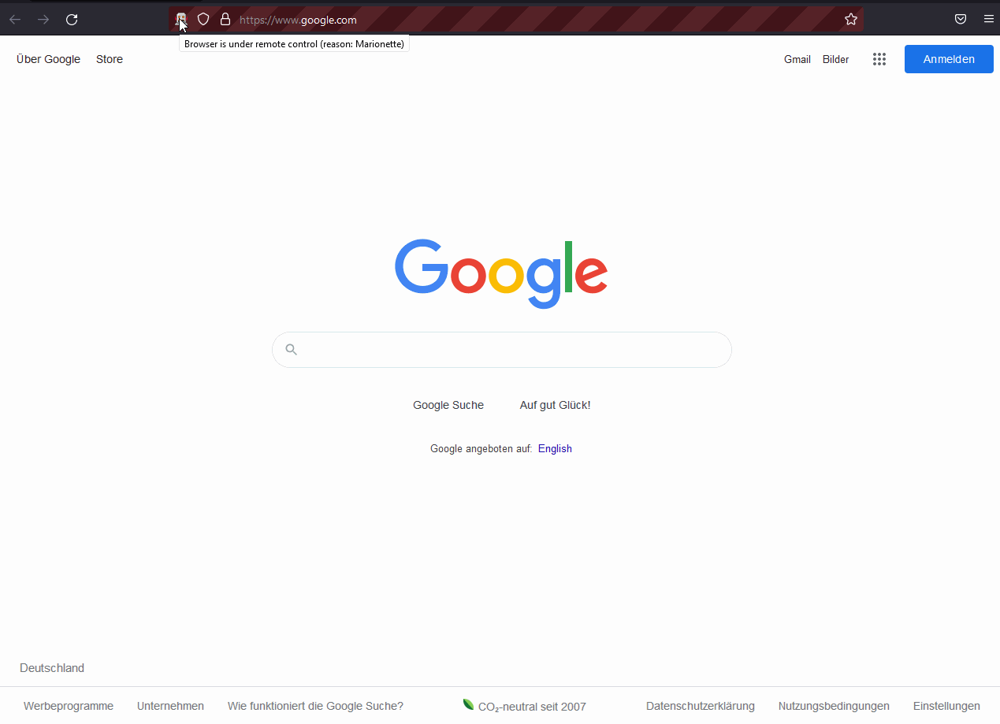

# Selenium for automated testing of web interfaces

Selenium homepage https://www.selenium.dev/:

"If you want to create robust, browser-based regression automation suites and tests, scale and distribute scripts across many environments, then you want to use Selenium WebDriver"

## Table of Contents
- [Overview](#overview-what-is-this-project)
- [Selenium in action](#selenium-in-action)
- [Usage](#usage)

## Overview: What is this project?

This project is my collection of tests with the Selenium WebDriver toolkit.
 It offers lots of functions needed for automating user interface tests. Its Java implementation feels intuitive as it also harmonizes with the JUnit library.
 You can find elements on a webpage by ccs locators or xpath, simulate clicks on submit buttons or hyperlinks, open new tabs, return to previous pages, switch to other tabs, take screenshots of the webpage and more.
 I have tested a lot of different functionalities and scenarios like iterating through a group of radio buttons (/option buttons), 
inputting login information, clicking cookie banners, using search functions, saving the html source code, web-scraping other data - there are a lot of applications for this tool, and it worked as expected.
 On the other hand most tests needed work to be done when running the tests after a hiatus as the XPaths of elements that I wished to find were changed, new elements were added (cookie banners) and hyperlinks were changed (e.g. to contain referrals), due to the website changing structure, re-naming and more.
 So for future work with this tool I have learned that I should consider writing more robust test cases so that the tests themselves are able to withstand the ultimate test - the test of time (pun intended).

## Selenium in action

## Usage

You need to specify which browser the Selenium WebDriver should use.
 I included two of such drivers to this project's lib folder, first being the Geckodriver that opens the Firefox browser when running the automated tests and the second one being the Chromedriver that opens Google Chrome.
 They need to be specified at the start of the tests so if something doesn't work it's most likely due to this integration.
 Run any of the tests to test specific things or the TestSuite class to run every test in succession.
 There is a "screenshots" folder where one of the tests saves an automated screenshot of the web-interface and this picture is deleted when the same test is re-run.
 The execution of some tests is slowed down by Thread.sleep() calls on purpose, in order to see the tool entering fields or clicking buttons as otherwise this happens very fast.
 For subsequent tests you should adjust the private functions at the bottom to have no delays. 
